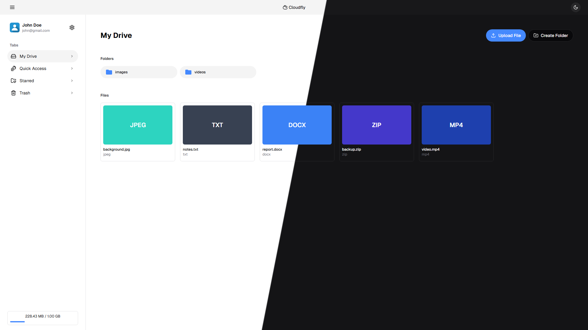

# Cloudfly


This project is a file storage and sharing web application built with the MERN stack (MongoDB, Express, React, Node.js). 

<p align="center">
    
</p>

> [!NOTE]
> This is **not a production-grade** cloud service, it's just a personal project I built to practice full stack development. However, it is quite suitable for **personal use** or **small team file sharing** scenarios.

## Stack

Layer|Technology|Purpose
-|-|-
Frontend|React + Typescript|Fast & type-safe UI
Styling|Shadcn UI + Tailwind CSS|Modern & responsive design
Backend|Node.js + Express.js|RESTful API 
Database|MongoDB|Flexible data storage
Auth|JWT + Google OAuth|Secure authentication
Encryption|Crypto (AES-256)|File encryption

## Features

- **Authentication & User Management**
  - Email/Password login and registration
  - Google OAuth ([Passport.js](https://www.passportjs.org/))
  - Cookie-based JWT
  - Forgot/Reset password (via [Nodemailer](https://nodemailer.com/))
  - Profile editing
  - Account deletion

- **File & Folder Management**
  - Upload files with AES encryption
  - Create folders and subfolders
  - Rename, move, star/unstar files and folders
  - File and folder search
  - Set files as public/private
  - Public shareable links for files
  - File preview
  - Trash bin

- **UI/UX**
  - Modern user interface ([Shadcn UI](https://ui.shadcn.com/))
  - Responsive design
  - Dark/light theme
  - Page transition effect ([Framer Motion](https://motion.dev/))
  - Loading states
  - Upload status display
  - Multi select + Selection rectangle
  - Drag and drop

## Prerequisites

**Required** 
- Node.js 
- npm (or alternatives)
- MongoDB

**Optional** 
- Docker (if you prefer running the app with containers)

**Accounts & Credentials**
  - **Google Cloud Console account**: For Google OAuth authentication, you'll need:
    - `Client ID`
    - `Client Secret`
  - **Gmail account**: For sending password reset emails, you'll need:
    - `App Password`

## Installation

1. **Clone the repository**
```bash
git clone https://github.com/7ched7/mern-cloudfly-app.git
cd mern-cloudfly-app
```

2. **Create environment variables**
- Create `.env.local` file in the `frontend` directory
```ini
VITE_BASE_URL=http://localhost:5173
VITE_BACKEND_URL=http://localhost:5000
```

- Create `.env` file in the `backend` directory
```ini
NODE_ENV=development
PORT=5000  

BASE_URL=http://localhost:5000  
FRONTEND_URL=http://localhost:5173  

# mongodb connection
MONGO_URI=your_mongo_database_url

# google oauth configuration
GOOGLE_CLIENT_ID=your_google_client_id
GOOGLE_CLIENT_SECRET=your_google_client_secret
GOOGLE_CALLBACK_URL=http://localhost:5000/api/auth/google/callback

# jwt configuration
JWT_SECRET=your_jwt_secret
JWT_LIFETIME=your_jwt_expiration

# session configuration
SESSION_SECRET=your_session_secret

# encryption configuration
ENCRYPTION_KEY=your_encryption_key_for_file_encryption

# nodemailer (Email service provider is Gmail)
EMAIL_SERVICE_EMAIL=your_google_email_address
EMAIL_SERVICE_PASSWORD=your_app_password_here
```

3. **Start the application**
- Manual
```bash
# terminal 1
cd backend && npm install && npm run dev

# terminal 2
cd frontend && npm install && npm run dev
```

- with Docker
```bash
docker-compose up
```

## API Endpoints

### Auth Routes
Endpoint|Method|Description
-|-|-
/api/auth/login|POST|Logs in a user
/api/auth/register|POST|Creates a new account
/api/auth/logout|POST|Logs out of the account
/api/auth/forgot-password|POST|Sends a password reset link
/api/auth/reset-password|POST|Sets a new password
/api/auth/verify-token|POST|Verifies JWT token

* Example Request
```json
POST /api/auth/login
{
  "email": "johndoe@mail.com",
  "password": "123456"
}
```

* Example Response
```json
{
  "firstName": "john",
  "lastName": "doe",
  "email": "johndoe@mail.com",
  "profileImage": "http://localhost:5000/images/default-profile-image.jpg",
  "currentStorage": 0,
  "maxStorage": 1073741824
}
```

### User Routes
Endpoint|Method|Description
-|-|-
/api/user/update-image|PUT|Updates the profile image
/api/user/remove-image|DELETE|Removes the profile image
/api/user/update-name|PUT|Updates the user's name
/api/user/change-password|PUT|Changes the current password
/api/user/delete|DELETE|Permanently deletes the account

* Example Request
```json
PUT /api/user/update-name
{ 
  "firstName": "jane", 
  "lastName": "doe" 
}
```

* Example Response
```json
{
  "firstName": "jane",
  "lastName": "doe",
  "message": "Your name has been successfully updated"
}
```

### Drive Routes
Endpoint|Method|Description
-|-|-
/api/drive/upload|POST|Uploads and encrypts files 
/api/drive/get/:id|GET|Retrieves files and folders
/api/drive/get-latest|GET|Retrieves the most recently uploaded items
/api/drive/search|GET|Searches files and folders
/api/drive/get-starred/:id|GET|Retrieves starred items
/api/drive/get-trashed|GET|Retrieves items in the trash
/api/drive/get-file/:id|GET|Retrieves file details
/api/drive/download/:id|GET|Downloads the file
/api/drive/create-folder|POST|Creates a new folder
/api/drive/rename|PUT|Renames a file or folder
/api/drive/star|PUT|Stars items
/api/drive/unstar|PUT|Removes star from the items
/api/drive/get-folders/:id|GET|Retrieves subfolders of a specific folder
/api/drive/move|PUT|Moves items to another folder
/api/drive/share-file|PUT|Makes a file public and generates a shareable link
/api/drive/make-file-private|PUT|Makes a file private
/api/drive/move-to-trash|PUT|Moves items to trash
/api/drive/restore|PUT|Restores items from the trash
/api/drive/delete|DELETE|Permanently deletes items
/api/drive/file-preview-public/:key|GET|Public file preview
/api/drive/get-file-public/:key|GET|Retrieves public file details
/api/drive/download-public/:key|GET|Downloads a public file

* Example Request
```json
POST /api/drive/create-folder
{ 
  "name": "images", 
  "parent": "root" 
}
```

* Example Response
```json
{
  "folder": {
    "_id": "69747e1a2d07f7cf14361d93",
    "parent": null,
    "name": "images",
    "isStarred": false
  },
  "message": "Folder created successfully"
}
```

## Contributing

Feel free to fork the repository and send a pull request.

## License

This project is licensed under the MIT License. See the [LICENSE](LICENSE) file for more information.
